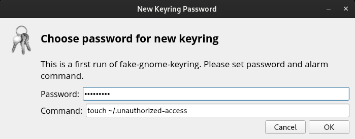
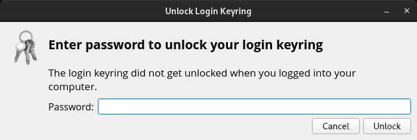

# fake-gnome-keyring
Fake GNOME Keyring window that launches a custom command if the password is entered incorrectly.

# Installation
1. Build it from sources or download binary
2. Run fake-gnome-keyring for the first time and set it up
3. Put fake-gnome-keyring in autostart

# Why use?
Your command will be executed in case of incorrect password or closing of this window, so you can use it to recognize unauthorized access to your system

# Screenshots

